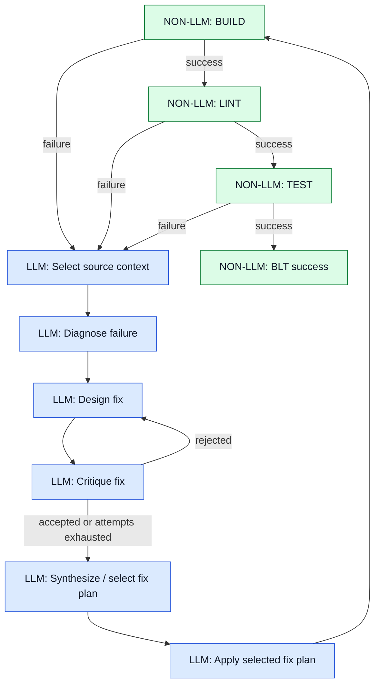

# BLT Execute Workflow

## Purpose

The Build/Lint/Test (BLT) workflow separates LLM-driven repair decisions from
deterministic validation. The LLM selects source context, diagnoses a failure,
designs and critiques repair plans, selects one plan, and applies it. Build,
lint, and test commands remain ordinary non-LLM processes and decide whether
the resulting project state is valid.

A central rule is:

> The LLM proposes and applies a repair; deterministic BLT execution validates
> the result.

## Execute flow

The diagram uses both color and explicit `LLM` / `NON-LLM` labels. Color is
only an additional visual cue.



## Deterministic BLT execution

`BLTWorkflow::build()` runs the configured commands in order:

1. BUILD
2. LINT, only if BUILD succeeds
3. TEST, only if LINT succeeds

The first failing stage returns its `Buildresult`. A completely successful
BUILD/LINT/TEST sequence finishes the workflow without invoking the repair LLM.

These stages are deliberately outside LLM control: compiler, linter, and test
results are the external validation of an applied repair.

## LLM repair cycle

When BLT reports an error, `BLTWorkflow::execute()` performs a constrained
repair cycle:

1. **Select source context** from the current build diagnostic.
2. **Diagnose** the failure, including factual context from the immediately
   preceding repair round when available.
3. **Design and critique** up to three candidate repair mechanisms. An accepted
   design stops the design loop early.
4. **Synthesize** by selecting one of the existing designs rather than creating
   a new combined design.
5. **Apply** only the selected plan.
6. Return control to BLT so BUILD/LINT/TEST can validate the modified project.

The APPLY phase is plan-focused. It does not use the old build diagnostic as a
new repair request after a plan has already been selected. A successful edit
therefore does not authorize APPLY to start repairing unrelated diagnostics;
the next BLT execution supplies fresh validation instead.

## Iteration and previous repair facts

A repair does not need to make the entire project valid in one LLM call. A
successful edit can expose another compiler or test failure. The next BLT
iteration works from the new project state.

For that next iteration the workflow may retain factual information from the
immediately preceding successful APPLY phase:

- the selected fix plan;
- the edits that were actually saved;
- the new current BLT result.

This context is evidence for the next diagnosis, not an instruction to continue
or preserve the previous repair.

## APPLY save recovery

A `save_file_part` can fail when its `original` block no longer matches the
current file. On an original-mismatch error, APPLY reloads the current file,
drops the stale failed tool dialogue, and continues with a compact recovery
note. Relative paths are resolved against the project directory.

This avoids repeatedly feeding an obsolete save action back to the LLM while
preserving the selected plan and other persistent APPLY context.

## Debug output

The short deterministic progress markers remain visible:

```text
## [BLT] BUILD
## [BLT] LINT
## [BLT] TEST
```

Detailed BLT/LLM execution output is controlled by the existing
`--debug` command-line switch. With `--debug`, source-selection counts,
diagnoses, candidate designs, critiques, synthesis selection, final plans, and
APPLY results are printed. Without `--debug`, these verbose intermediate
results stay quiet while BUILD/LINT/TEST progress and errors remain visible.
